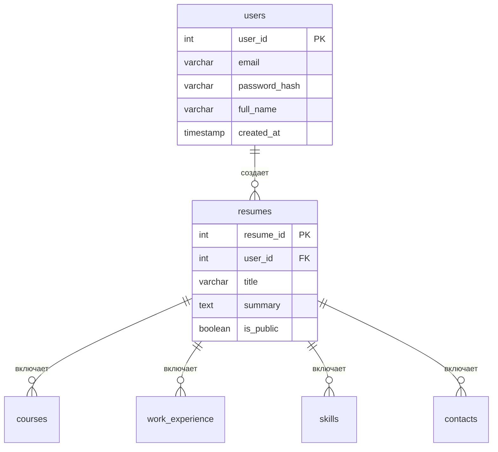

```mermaid
erDiagram
    users ||--o{ resumes : "создает"
    resumes ||--o{ courses : "включает"
    resumes ||--o{ work_experience : "включает"
    resumes ||--o{ skills : "включает"
    resumes ||--o{ contacts : "включает"

    users {
        int user_id PK
        varchar email
        varchar password_hash
        varchar full_name
        timestamp created_at
    }
    
    resumes {
        int resume_id PK
        int user_id FK
        varchar title
        text summary
        boolean is_public
    }
```
